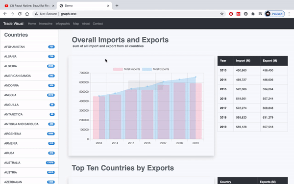
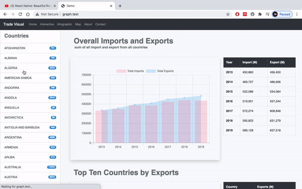
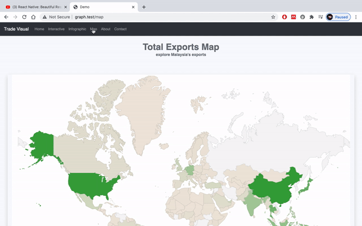
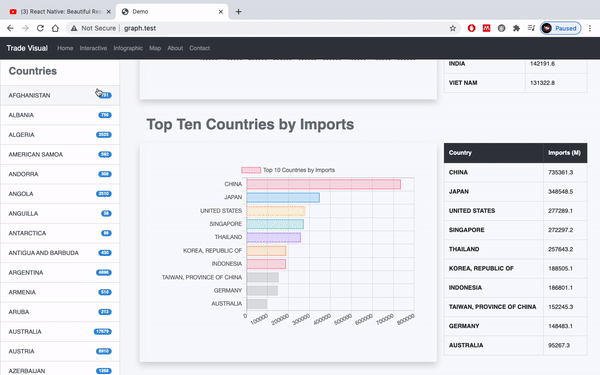

## Data Source
1. Malaysia Import Export by partner country, SITC 5D 2013-2019.csv
2. 1D -> 5D.csv

## Installation Requirement
- Laravel
- Composer
- NPM

## DB Setup
- Run 'php artisan migrate:fresh' before importing data into DB through Sequel Pro

## Installation Steps
- Download project as zip or pull project from git provider
- Inside project directory, run 'composer install' 
- Run 'npm install'
- Run 'cp .env.example .env'
- Change DB_DATABASE value inside .env file according to DB name
- Run 'php artisan key:generate:
- Run 'php artisan migrate:fresh'
- Import data into DB 
- Run 'php artisan serve'

## Objective
TradeVisual is a web application to visualize the trade dataset provided by Department of Statistic Malaysia. The friendly user interface paired with simplistic visualization allows better insight into the trade dataset for audience from all walks of life. The projet is part of a submission for Datathon 2020 by Department of Statistic Malaysia

## Data Source
https://cloud.stats.gov.my/index.php/s/teDxHCfK6RWQcj3/authenticate (Malaysia Import Export by partner country, SITC 5D 2013-2019.csv)

## Demo
### Main Page

### Interactive (Comparison between countries)

### Infographic (Whole summary of a single country)

### Interactive map view (Google API)

### Individual category viewing

